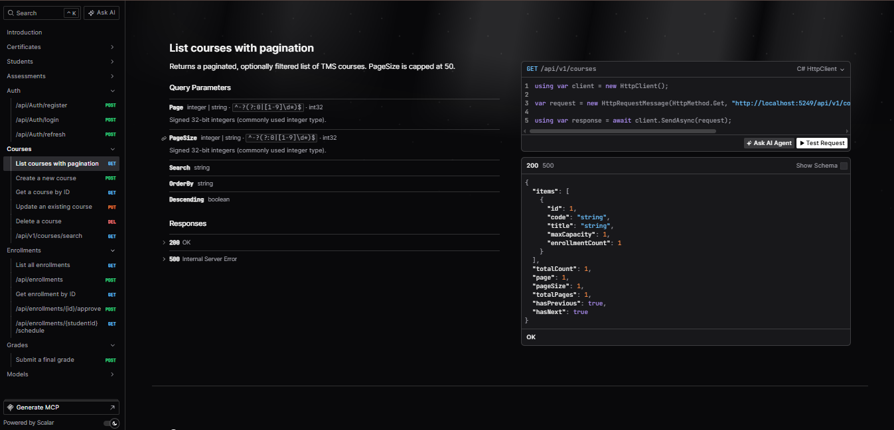
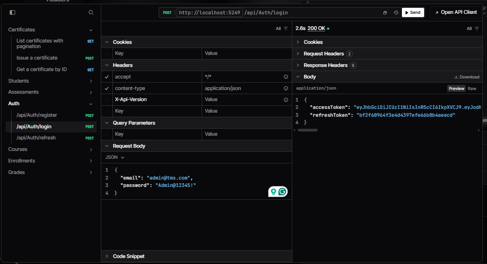
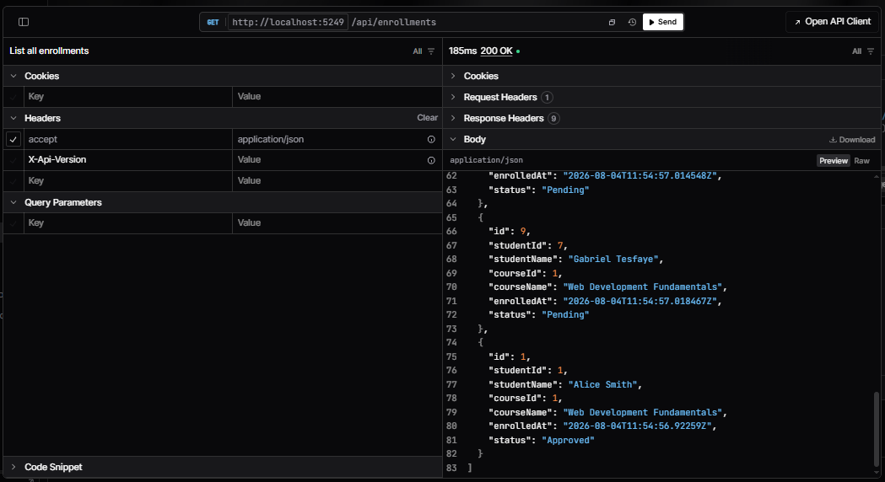
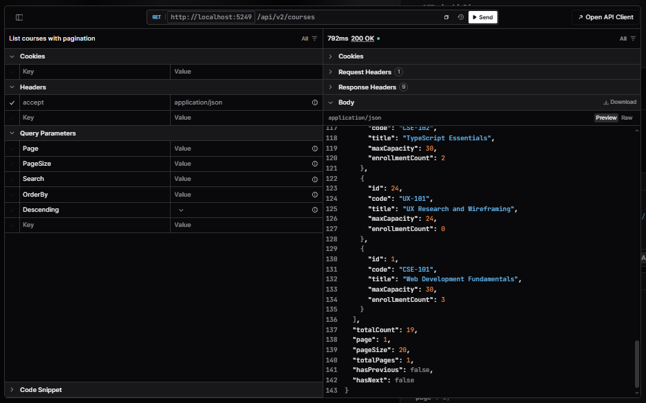

# Training Management System API

The TMS API is an ASP.NET Core application that provides authentication, course management, enrollments, assessments, grades, certificates, transcripts, authorization, rate limiting, and real-time enrollment notifications.

## Solution structure

```text
TmsApi/
  TmsApi.Api/             ASP.NET Core host, controllers, middleware, auth, and startup
  TmsApi.Application/     Use cases, commands, queries, DTOs, validation, and interfaces
  TmsApi.Domain/          Core entities and domain rules
  TmsApi.Infrastructure/  EF Core persistence, Identity, services, caching, and workers
  TmsApi.Tests/           xUnit, NSubstitute, and WebApplicationFactory tests
```

## Technology

- .NET 10 and ASP.NET Core Web API
- Entity Framework Core with PostgreSQL
- ASP.NET Core Identity and JWT bearer authentication
- MediatR and FluentValidation
- API versioning, SignalR, hybrid caching, and rate limiting
- xUnit, NSubstitute, and ASP.NET Core integration testing

## Prerequisites

- .NET 10 SDK
- PostgreSQL
- A database named `TmsDb`, or an equivalent configured database

## Database setup

Copy the development configuration template:

```bash
cp TmsApi.Api/appsettings.Development.example.json TmsApi.Api/appsettings.Development.json
```

On Windows PowerShell:

```powershell
Copy-Item TmsApi.Api/appsettings.Development.example.json TmsApi.Api/appsettings.Development.json
```

Update the PostgreSQL connection string, or configure it using User Secrets.

The application applies pending EF Core migrations and seeds development data when running in the `Development` environment.

## Development User Secrets

From the `TmsApi` directory:

```bash
dotnet user-secrets set "SeedAdmin:Email" "admin@tms.com" --project TmsApi.Api
dotnet user-secrets set "SeedAdmin:Password" "Admin@12345!" --project TmsApi.Api
dotnet user-secrets set "SeedAdmin:FirstName" "System" --project TmsApi.Api
dotnet user-secrets set "SeedAdmin:LastName" "Administrator" --project TmsApi.Api
dotnet user-secrets set "SeedAdmin:Role" "Admin" --project TmsApi.Api
dotnet user-secrets set "Jwt:Key" "SET_A_LONG_RANDOM_DEVELOPMENT_KEY_AT_LEAST_32_CHARS" --project TmsApi.Api
dotnet user-secrets set "Jwt:Issuer" "https://localhost:5249" --project TmsApi.Api
dotnet user-secrets set "Jwt:Audience" "tms-client" --project TmsApi.Api
dotnet user-secrets set "Jwt:ExpiryMinutes" "15" --project TmsApi.Api
```

The development seed account is idempotent and is created only in Development:

```text
Email: admin@tms.com
Password: Admin@12345!
Role: Admin
```

Use a different password outside local evaluation. The committed `appsettings.Development.example.json` contains a placeholder instead of the real password.

## Run the API

```bash
dotnet run --project TmsApi.Api
```

Default development URLs:

```text
HTTP:  http://localhost:5249
HTTPS: https://localhost:7093
```

The Angular client runs at `http://localhost:4200` and is included in the configured CORS policy.

## API documentation and routes

When running in Development, OpenAPI and Scalar are available from the API host. Important routes include:

```text
POST /api/auth/login
POST /api/auth/refresh
GET  /api/v2/courses
POST /api/v2/enrollments
POST /api/v2/enrollments/{id}/approve
GET  /api/enrollments
POST /api/grades
```

## Tests

Run the complete .NET test suite:

```bash
dotnet test
```

Run only the test project:

```bash
dotnet test TmsApi.Tests/TmsApi.Tests.csproj
```

The test project includes pure grading logic tests, enrollment handler tests using NSubstitute, and API contract tests using `WebApplicationFactory` with EF Core InMemory.

## Screenshots

### Scalar API reference



### Authentication response



### Enrollment endpoint response



### Course endpoint response


